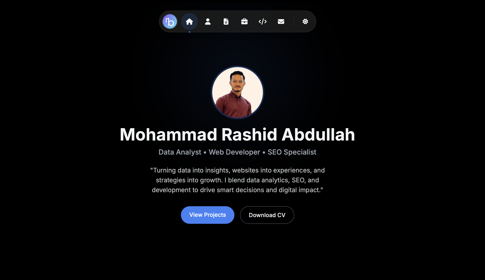

# Mohammad Rashid's Personal Portfolio 🌐

A personal portfolio website for **Mohammad Rashid**, highlighting experience in data analytics, web development, and SEO.

## 🔗 Live Site

👉 [https://rasyidbejay.github.io](https://rasyidbejay.github.io)

## ✨ Highlights

- Clean, responsive portfolio layout
- Dedicated pages for experience, education, projects, and skills
- Project and certification assets included in-repo
- Hosted with GitHub Pages

## 🧰 Tech Stack

- **HTML5**
- **CSS3**
- **JavaScript (Vanilla)**
- **GitHub Pages**

## 📁 Project Structure

```text
.
├── index.html
├── projects.html
├── experience.html
├── education.html
├── skills.html
├── contact.html
├── thank-you.html
├── css/
├── js/
├── assets/
└── data.json
```

## 🚀 Run Locally

Since this is a static website, you can open `index.html` directly in your browser.

For a better local dev experience, run a simple local server:

```bash
python3 -m http.server 8000
```

Then visit:

```text
http://localhost:8000
```

## 📸 Preview



## 🤝 Contact

If you'd like to collaborate, feel free to reach out through the contact page on the site:

- [Contact Form](https://rasyidbejay.github.io/contact.html)

---

Thanks for visiting! 🙌
