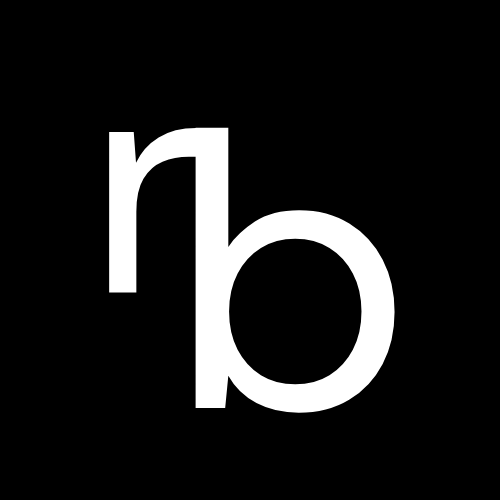

# Rashid Abdullah

**Frontend Developer · Kuala Lumpur, Malaysia**

---

## 👋 About Me

Frontend Developer with a Bachelor's in Business Administration (Minor in Information Systems) from **International Islamic University Malaysia (IIUM)**, graduating with **Dean's List honours**.

I craft fast, beautiful, and accessible web experiences using modern frontend frameworks and tools. Passionate about clean code, great UX, and building things that work beautifully across all devices.

> 🟢 **Currently available for freelance projects**

---

## 🛠 Tech Stack

### Frontend

### Styling & Motion

### Backend & Database

### Tools & DevOps

---

## 🚀 Featured Projects

| Project | Category | Stack | Links |
|---------|----------|-------|-------|
| **BRØW — Luxury Coffee E-Commerce** | E-Commerce | Vue 3, Pinia, Vue Router | [Live](https://rasyidbejay.github.io/brow-store/) · [Repo](https://github.com/rasyidbejay/brow-store) |
| **Lumen Agency — Marketing Website** | Frontend | Vue 3, Vite, Vue Router | [Live](https://rasyidbejay.github.io/lumen-agency/) · [Repo](https://github.com/rasyidbejay/lumen-agency) |
| **Ripple Habits — Habit Tracker** | Full-Stack | React, TypeScript, Tailwind | [Live](https://rasyidbejay.com/ripplehabits) · [Repo](https://github.com/rasyidbejay/ripplehabits) |
| **ERP Webstore — Riwei Marketing** | E-Commerce | SiteGiant, GA4, Custom CSS | [Live](https://riwei.com.my) |
| **Britannia Language Centre** | Frontend | WordPress, Core Web Vitals | [Live](https://britannia.edu.my) |
| **HabitFlow — Task Tracker** | Full-Stack | Python, Flask, SQLAlchemy | — |

---

## 📜 Certifications

| Certification | Issuer | Year |
|--------------|--------|------|
| Google Data Analytics Professional Certificate | Google · Coursera | 2025 |
| Google Data Analytics | Google · Credly | 2025 |
| MOHE-MDEC Global Outsourcing Talent Programme | MDEC Malaysia | 2025 |
| Career Essentials in Data Analysis | Microsoft · LinkedIn Learning | 2024 |
| Data Visualization | freeCodeCamp | 2024 |

---

## 📊 GitHub Stats

---

**Built with React + Vite + Framer Motion · Deployed on GitHub Pages**

⭐ If you like my work, consider starring this repo!

